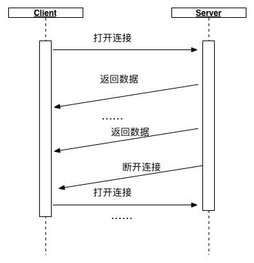

# Comet

## 1. 概述

Comet是Alex Russell发明的一个词，指的是一种更高级的Ajax技术，它是一种服务器向页面推送数据的技术。

其实Comet涉及一个更大的话题，那就是页面与服务器的`实时通信`的问题，会以这个方面来讲。

## 2. 实现

目前来说，实现comet的有两种方式

1. 长轮询
2. websocket

长轮询是传统的短轮询的改进，短轮询也是实现`实时通信`的方式之一。

### 2.1 短轮询

实现思路为每隔一段时间，页面向服务器发送一次请求。这种实现方式优点是实现简单，然而缺点也很明显，它盲目发送请求，加重网络负载，增加服务器的负担，会有很多不必要的开销。

常规的实现有XHR轮询，每10s或30s轮询一次。

### 2.2 长轮询

长轮询的实现思路为页面向服务器发送请求时，服务器挂起连接，直到有数据可发送，在发送完数据之后，浏览器再关闭连接，随机页面又发起一个到服务器的新请求。

这种实现方式，需要考虑的有几点

1. 不要在同一个客户端同时使用超过两个HTTP长连接，因为在HTTP1.1规范中规定，客户端不应该与服务器端建立超过两个HTTP连接，新的连接会被阻塞。在IE浏览器严格遵守了这个规定。

2. 长连接需要考虑服务端的性能，在一个大型商业应用中，服务端需要维护大量并发的长连接。

3. 长连接需要在页面和服务器之间保持`心跳`信息，确认双方都在正常运行。

具体的实现方式如下：

**1. HTTP长轮询**

利用JSONP方式，把script标签附加到页面上，让脚本执行，服务器会挂起连接直到有事件发生，接着把脚本内容发送回浏览器，然后重新打开另一个script标签来获取下一个事件，从而实现长轮询的模型。

**2. XHR长轮询**

这是比较常用的方式。客户端打开一个到服务器端的Ajax请求，然后等待响应，服务器端需要一些特定的功能来允许请求被挂起，只要一有事件发生，服务器端就会在挂起的请求中送回响应并关闭该请求。客户端在处理完服务器返回的信息后，再次发出请求，重新建立连接，如此循环。

* 优点

    客户端很容易实现良好的错误处理系统和超时管理，实现成为与Ajax轮询的方式类似。

* 缺点

    需要服务器端有特殊的功能来临时挂起连接。
    当客户端发起的连接较多时，服务器端会长期保持多个连接，具有一定的风险。

**3. iframe**

通过在HTML页面里嵌入一个隐藏帧，然后将这个隐藏帧的src属性设为对一个长连接的请求，服务器端就能源源不断地往客户端输入数据。

* 优点

    这种方式每次数据传送不会关闭连接（连接只会在通信出现错误时，或是连接重建时关闭）。

* 缺点

    IE、Morzilla、Firefox下端的进度栏都会显示加载没有完成，而且IE上方的图标会不停的转动，表示加载正在进行。不过在IE下，有解决的办法。

此外，还有一些实现长轮询的框架，在这里就不一一介绍了。

## 2.3 websocket

websocket是HTML5新的API，在[下一个小节](./websocket.md)进行详细的介绍。可以看到，websocket的实现方式其实是更加地合理的，目前的浏览器的支持也越来越好。

## 参考

1. [浏览器与服务器的消息通信](http://blog.brucefeng.info/post/brower-server-msg)
2. 《JavaScript高级程序设计》
3. 《JavaScript权威指南》
