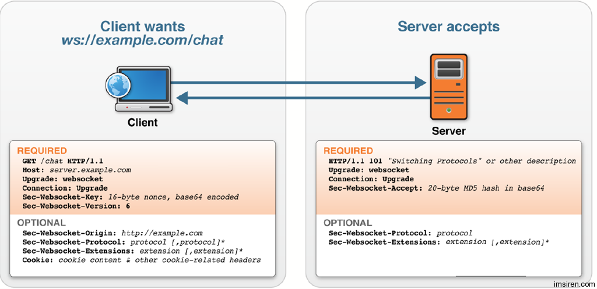

# WebSocket

websocket的出现是为了弥补http的不足，如今这项技术已被广泛应用于我们熟悉的网站，例如github、stackoverflow等等。

## 基本认识

1. WebSocket是Web应用程序的传输协议，它提供了`双向的、按序到达的数据流`。

2. 高层的协议能够在WebSocket上运行。

3. 作为Web的一部分，WebSocket连接的是URL。

## WebSocket握手



为了建立WebSocket通信，客户端和服务器在初始握手时，将HTTP协议升级到了WebSocket协议。

**从客户端到服务器**

    GET /chat HTTP/1.1
    Host: example.com
    Connection: Upgrade
    Sec-WebSocket-Protocol: Sample
    Upgrade: websocket
    Sec-WebSocket-Version: 13
    Sec-WebSocket-Key: .....
    Origin: http://example.com

    [8-byte security key]

**从服务器到客户端**

    HTTP/1.1 101 WebSocket Protocol Handshake
    Upgrade: websocket
    Connection: Upgrade
    Sec-WebSocket-Accept: ...
    WebSocket-Protocol: sample


一旦连接成功，就可以在全双工模式下在客户端和服务器之间来回传送Websocket消息。这就意味着，在同一时间、任何方向，都可以全双工发送基于文本的消息。在网络中，每个消息以Ox00字节开头，以OxFF结尾，中间数据采用UTF-8编码格式。

## WebSocket API

采用Websocket API的流程

1. 创建Socket

    ```javascript
    var socket = new WebSocket('ws://www.example.com:1234/resource');
    ```

2. 注册事件处理程序

    ```javascript
    socket.onopen = function(e){/*socket已经连接*/}

    socket.onclose = function(e){/*socket已经关闭*/}

    socket.onerror = function(e){/*出错了*/}

    socket.onmessage = function(e){
        var message = e.data; /*服务器发送一条消息*/
    }
    ```

3. 发送数据

    ```javascript
    socket.send('Hello World');
    ```

4. 关闭Socket

    ```javascript
    socket.close();
    ```

## 搭建简易实验环境

基于node的`Socket.IO`来搭建服务器端。

Socket.IO可以接收所有与服务器端相连接的客户端发送的消息，也可以向这些客户端发送消息。它可以实现以下几种通信方式：

* HTML5的Websocket
* 在Flash中使用WebSocket通信
* XHR轮询
* JSONP轮询
* Forever Iframe

安装 `npm install socket.io`

## 参考

1. 《HTML5程序设计》
2. 《JavaScript权威指南》
