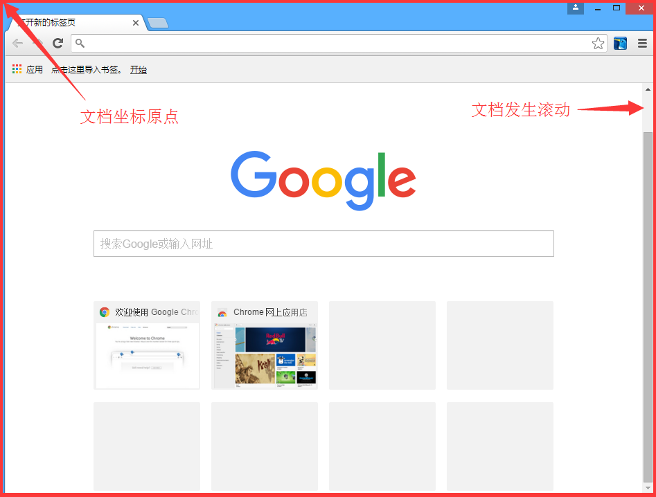
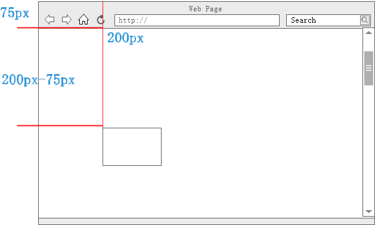
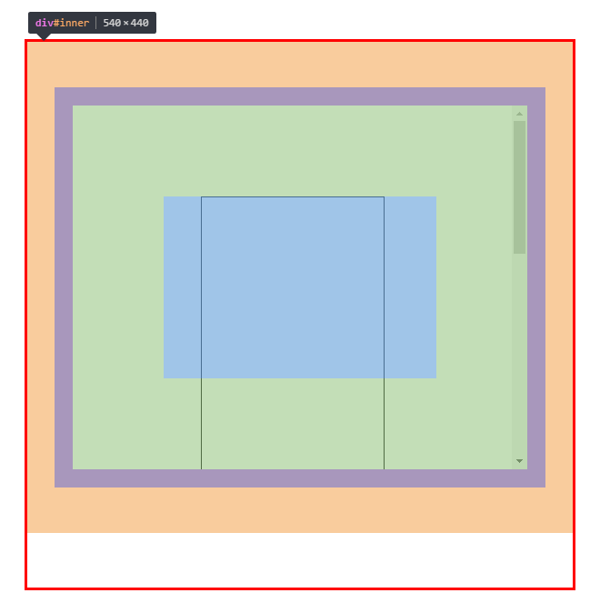
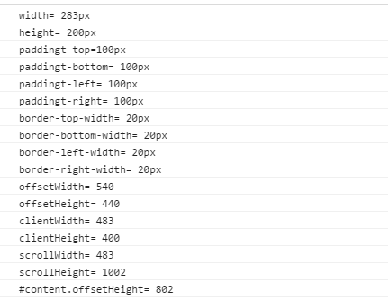
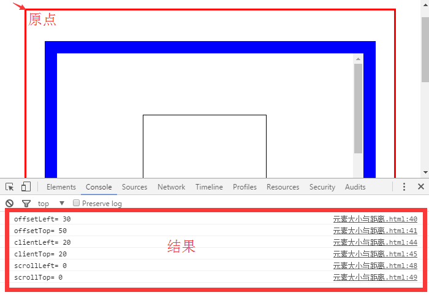

# 元素大小与坐标计算

## 一、文档坐标和视口坐标

### 1-1 X & Y坐标

元素的位置是以像素来度量的，向右代表`X坐标`的增加，向下代表`Y坐标`的增加。

### 1-2 两个坐标原点

1. 视口坐标原点

    `视口`只是实际显示文档内容的浏览器的一部分。

    

2. 文档坐标原点

    1. 如果文档比视口要小，或者没出现滚动，则文档的左上角就是视口的左上角

    2. 如果出现了滚动，文档坐标原点就发生了变化。

    

### 1-3 坐标转换的例子

在文档坐标中，如果一个元素的Y坐标是200px，用户已经把浏览器向下滚动75px，则



### 1-4 获取滚动条位置

```javascript
function getScrollOffsets(w){
    //使用指定的窗口，如果不带参数则使用当前窗口
    w = w || window;

    //除了IE8及更早的版本以外，其他浏览器都能用
    if (w.pageXOffset !== null){
        return {
            x : w.pageXOffset,
            y : w.pageYOffset
        };
    }

    //对标准模式下的IE（或任何浏览器）
    var d = w.document;
    if (document.compatMode == 'CSS1Compat'){
        return {
            x : d.documentElement.scrollLeft,
            y : d.dcoumentElement.scrollTop
        };
    }

    //对怪异模式下的浏览器
    return {
        x : d.body.scrollLeft,
        y : d.body.scrollTop
    };
}
```

### 1-5 查询窗口的视口尺寸

```javascript
function getViewportSize(w){
    w = w || window;

    //除了IE8及更早的版本，其他浏览器都能用
    if (w.innerWidth != null){
        return {
            w : w.innerWidth,
            h : w.innerHeight
        };
    }

    //对标准模式下的IE（或任何浏览器）
    var d = w.document;
    if (document.compatMode == 'CSS1Compat'){
        return {
            w : d.documentElement.clientWidth,
            h : d.documentElement.clientHeight
        };
    }
}
```

## 二、元素的大小

要理解`client`和`scroll`属性，需要知道HTML元素的实际内容有可能比分配用来容纳内容的盒子更大，因此单个元素可能有滚动条。

内容区域是视口，就像浏览器的窗口，当实际内容比视口更大时，需要把元素的滚动条位置考虑进去。

## 二、元素的几何尺寸

**getBoundingClientRect()**

这个是判定一个元素的尺寸和位置最简单的方法。现在所有浏览器都实现了。这个方法返回元素在`视口坐标中`的位置。返回的值包含元素的边框和内边距。

    (left,top)：表示元素左上角的X和Y坐标

    (right,bottom)：表示元素右上角的X和Y坐标


**getClientRects()**

对于一个内联元素来说，可能跨了多个矩形组成。如果向查询`内联`元素每个独立的矩形，调用这个方法可以获得一个只读的类数组对象，它的每个元素都类似于getBoundingClientRect()返回的矩形对象。

*这两个方法都不是实时的，它们只是调用方法时，文档视觉状态的静态快照，在用户滚动或改变浏览器窗口大小时不会更新它们。*

### 2-1 转化为文档坐标

为了转化为用户滚动浏览器窗口以后仍然有效的文档坐标，需要加上`滚动的偏移量`。

```javascript
var box = e.getBoundingClientRect();
var offsets = getScrollOffsets();
//左上角文档坐标
var x1 = box.left + offsets.x;
var y1 = box.top + offsets.y;
//右下角文档坐标
var x2 = box.right + offsets.x;
var y2 = box.bottom + offsets.y;
```

### 2-2 获取元素的宽和高

```javascript
var box = e.getBoundingClientRect();
var w = box.width || (box.right - box-left); 
var h = box.height || (box.bottom - box.top);
```


## 几个概念

在客户端编程中，使用的坐标通常都是视口坐标，如果需要获得文档坐标，要进行转换。
    
* getBoundingClientRect()
 * 鼠标事件处理程序函数中的对象的坐标是在视口坐标
* window对象的scrollTop方法，接收的是文档坐标

padding是一个元素所占大小的概念，margin是个定位的概念。

## offset

### offsetWidth & offsetHeight

任何HTML元素的只读属性offsetWidth和offsetHeight已CSS像素返回它的屏幕尺寸，返回的尺寸包干元素的边框和内边距（width/height + border + padding），和滚动条。

### offsetLeft & offsetTop

所有HTML元素拥有offsetLeft和offsetTop属性来返回元素的X和Y坐标

1. 相对于已定位元素的后代元素和一些其他元素（表格单元），这些属性返回的坐标是相对于祖先元素
2. 一般元素，则是相对于文档，返回的是文档坐标

offsetParent属性指定这些属性所相对的父元素，如果offsetParent为null，则这些属性都是文档坐标

```javascript
//用offsetLeft和offsetTop来计算e的位置
function getElementPosition(e){
    var x = 0,y = 0;
    while(e != null) {
        x += e.offsetLeft;
        y += e.offsetTop;
        e = e.offsetParent;
    }
    return {
        x : x,
        y : y
    };
}
```

## client 

`client`是一种间接指代，它就是web浏览器客户端，专指它定义的窗口或视口。

### clientWidth & clientHeight

clientWidth和clientHeight类似于offsetWidth和offsetHeight，不同的是不包含边框大小（width/height + padding）。同时在有滚动条的情况下，clientWidth和clientHeight在其返回值中也不包含滚动条。

*对于类似<i\>、<code\>、<span\>等内联元素，总是返回0*

### clientLeft & clientTop

返回元素的内边距的外边缘和他的边框的外边缘的水平距离和垂直距离，通常这些值就等于左边和上边的边框宽度。

在有滚动条时，并且浏览器将这些滚动条放置在左侧或顶部（反正我是没见过），clientLEft和clientTop就包含这些滚动条的宽度。

## scroll

### scrollWidth & scrollHeight

这两个属性是元素的内容区域加上内边距，在加上任何溢出内容的尺寸.

因此，如果没有溢出时，这些属性与clientWidth和clientHeight是相等的。

### scrollLeft & scrollTop

指定的是元素的滚动条的位置

scrollLeft和scrollTop都是可写的属性，通过设置它们来让元素中的内容滚动。

## width和height计算实例

在这个实例中，我们观察#inner实例，看看该元素各个属性之间的关系

```html
<!DOCTYPE html>
<html lang="en">
<head>
    <meta charset="UTF-8">
    <title>Document</title>
    <style>
     #wrap {
        border : 3px solid red;
        width: 600px;
        height : 600px;
        margin : 50px auto;
    }
    #inner {
        padding : 100px;
        width: 300px;
        height:200px;
        margin:50px auto;
        border:20px solid blue;
        overflow: auto;
    }
    #content{
        width: 200px;
        height:800px;
        border:1px solid black;
      }
    </style>
</head>
<body>
    <div id="wrap">
        <div id="inner">
            <div id="content"></div>
        </div>
    </div>
</body>
</html>
```



```javascript
var inner = document.getElementById('inner');
var content = document.getElementById('content');
//辅助变量，获取元素的宽和高
var style = getComputedStyle(inner);

//width & height
console.log('width= '+style.width);// ''
console.log('height= ' + style.height);// ''

//padding
console.log('paddingt-top='+style.paddingTop);
console.log('paddingt-bottom= '+style.paddingBottom);
console.log('paddingt-left= '+style.paddingLeft);
console.log('paddingt-right= '+style.paddingRight);

//border
console.log('border-top-width= '+style.borderTopWidth);
console.log('border-bottom-width= '+style.borderBottomWidth);
console.log('border-left-width= '+style.borderLeftWidth);
console.log('border-right-width= '+style.borderRightWidth);

//offsetWidth & offsetWidth
console.log('offsetWidth= '+inner.offsetWidth);
console.log('offsetHeight= '+inner.offsetHeight);

//clientWidth & clientHeight
console.log('clientWidth= '+inner.clientWidth);
console.log('clientHeight= '+inner.clientHeight);

// scrollWidth & scrollHeight
console.log('scrollWidth= '+inner.scrollWidth);
console.log('scrollHeight= '+inner.scrollHeight);

// #content.offsetHeight
console.log('#content.offsetHeight= '+content.offsetHeight);
```

由于元素是外链的样式，没有设置style，因此如果直接使用`inner.style.width`返回的是空。必须使用`getComputedStyle(el)`来获取元素的宽和高



说明：

**宽度**

1. width：本来应该是300，但是由于存在滚动条（在水平方向占据了空间），因此

    `原本内容区宽度（width） - 滚动条宽度 = 300 - 17 = 283`

2. offsetWidth：元素实际所占空间，滚动条也是元素占据的空间，因此

    `width + 滚动条 + padding + border = 300 + 100 + 100 + 20 + 20 = 540`

3. clientWidth：除去边框占据的空间，且不包含滚动条

    `width + padding = 283 + 100 + 100 = 483`

4. scrollWidth：由于水平方向没有溢出，因此

    `clientWidth + 溢出部分 = 483 + 0 = 483`

**高度**

1. height：由于垂直方向没有滚动条占据空间，因此

    `原本内容区高度（height）- 滚动条高度 = 200 - 0 = 200`

2. offsetHeight：元素实际所占空间，由于采取了滚动的方式处理了溢出的部分，因此
 
    `height + padding + border = 200 + 100 + 100 + 20 + 20 = 440`

3. clientHeight：

    `height + padding = 200 + 100 + 100 = 400`

4. scollHeight：客户区高度，加上溢出的部分，即包含元素真实高度-内容区的高度

    `height+padding+(#content.offsetHeight-height)=200+100+100+802-200=1002`

## left和top实例

html结构与上一个实例一直。这样可以

```html
<!DOCTYPE html>
<html lang="en">
<head>
    <meta charset="UTF-8">
    <title>Document</title>
    <style>
     #wrap {
        border : 3px solid red;
        width: 600px;
        height : 600px;
        margin : 50px auto;
        position:relative;
    }
    #inner {
        padding : 100px;
        width: 300px;
        height:200px;
        margin:50px auto;
        border:20px solid blue;
        overflow: auto;
    }
    #content{
        width: 200px;
        height:800px;
        border:1px solid black;
      }
    </style>
</head>
<body>
    <div id="wrap">
        <div id="inner">
            <div id="content"></div>
        </div>
    </div>
</body>
</html>
```

分别获取属性

```javascript
var inner = document.getElementById('inner');

//offsetLeft & offsetTop
console.log("offsetLeft= "+inner.offsetLeft);
console.log("offsetTop= "+inner.offsetTop);

//clientLeft &  clientTop
console.log("clientLeft= "+inner.clientLeft);
console.log("clientTop= "+inner.clientTop);

// scrollLeft & scrollTop
console.log("scrollLeft= "+inner.scrollLeft);
console.log("scrollTop= "+inner.scrollTop);

//让文档滚动
inner.scrollTop = 30;

//为了计算的方便
var style = getComputedStyle(inner);

```

结果如图



分析：

(#wrap为参照原点，设置了`position:relative`)

1. offsetLeft：即元素的x坐标，(#inner设置了自动居中)

    `offsetLeft = (#wrap.width - #inner.offsetWidth)/2 =30`

2. offsetTop：即元素的y坐标，（style是#inner元素的计算后的样式）

    `offsetTop = style.marginTop = 50`

3. clientLeft 即 border-left-width

    `clientLeft = style.borderLeftWidth = 20`

4. clientTop 即 border-top-width

    `clientTop = style.borderTopWidth = 20`

5. scrollLeft 由于水平方向没有滚动条，因此为0
6. scrollTop 即滚动条离#inner border-top内侧的位置，一开始为0

## 来源

1. 《JavaScript权威指南》